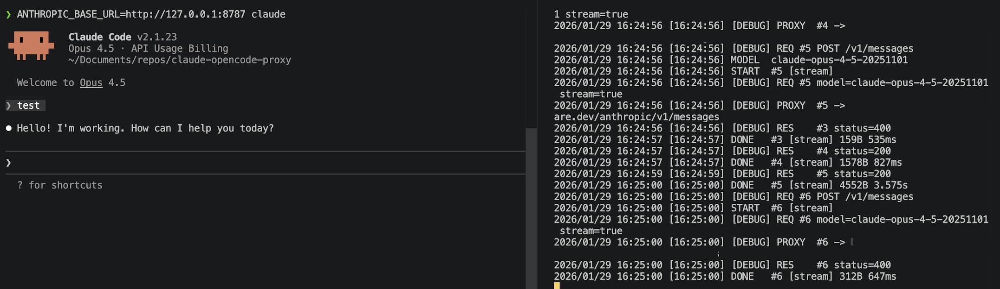

# Claude Opencode Proxy

Proxy for Claude Code CLI to use OpenCode, Cloudflare AI Gateway, or direct Anthropic API.



## Build
_Step 0: Build_

### Add to PATH (optional)
```bash
make install
# or go build -o claude-opencode-proxy
# then manually: sudo mv claude-opencode-proxy /usr/local/bin/
```

## Providers
_Step 1: Set your provider config_

### OpenCode Server
```bash
claude-opencode-proxy config --target https://opencode.example.com/anthropic --login-url https://opencode.example.com
claude-opencode-proxy login
```

### Direct Anthropic API
```bash
claude-opencode-proxy config --target https://api.anthropic.com/v1 --api-key sk-ant-xxx
```

### Cloudflare AI Gateway
```bash
claude-opencode-proxy config --target https://gateway.ai.cloudflare.com/v1/ACCOUNT/GATEWAY/anthropic --api-key sk-ant-xxx
```

## Run
_Step 2: Run Claude Code via Proxy_

```bash
# Step 1. Pick a provider (see above)
# Step 2. Run these commands:
claude-opencode-proxy login

# Swaps from Claude Code API -> Custom Provider
claude-opencode-proxy enable

# Runs Claude Code with Provider
claude-opencode-proxy run

# OR run Claude Code directly
ANTHROPIC_BASE_URL=http://127.0.0.1:8787 claude
```

## Disable Proxy/Revert back to Claude Code

To stop using the proxy and restore Claude's native auth:

```bash
claude-opencode-proxy stop
claude-opencode-proxy disable
claude /login
```

## Commands

| Command | Description |
|---------|-------------|
| **Setup** | |
| `config --target URL --api-key KEY` | Configure for API key auth |
| `config --target URL --login-url URL` | Configure for OAuth login |
| `config` | View current config |
| `config --reset` | Reset to defaults |
| `login` | Login via browser (OpenCode) |
| `enable` | Configure Claude to use proxy |
| `disable` | Restore Claude defaults |
| **Running** | |
| `serve` | Start proxy (background) |
| `serve -f` | Start proxy (foreground) |
| `serve -v` | Verbose logging |
| `stop` | Stop proxy |
| `logs` | Tail proxy logs |
| `run` | Launch Claude Code |
| `run --model MODEL` | Launch with specific model |
| `status` | Show full status |
